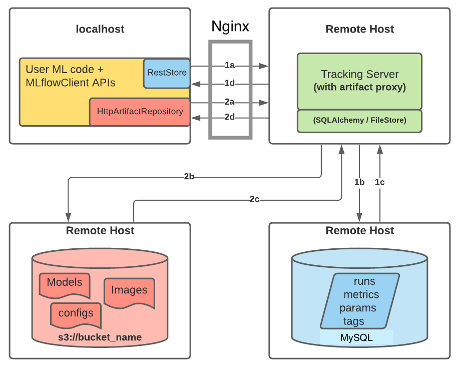

# MLFlow Tracking Server

This repo contains infrastructure as code to quickly set up an MLflow Tracking server on AWS.

It uses the following AWS services:

* S3
* RDS (MySQL database
* Elastic Container Registry (ECR)
* AWS Application Runner (APR

## MLFlow Architecture

MLflow is an open source platform for the management of the machine learning lifecycle. In this project we use it for the purpose of tracking experiments. MLflow tracking allows the tracking of experiments using  Python, REST, R API, and Java API APIs. The elements tracked include model parameters, metrics, the models resulting from the experiments, and informative plots.

The components of a tracking are:

* HTTP server: the server hosting the MLflow Tracking server;
* Backend store: a database used to store experiment metadata, parameters, and metrics;
* Artifact store: a volume used to store artifacts, which are the file outputs of experiments, including files, plots, etc.

The architecture followed in this project corresponds to a scenario described in the [tracking server documentation](), in which the MLflow Tracking server runs on a remote host (in this case the AWS Application Runner) with an artifact store set in an S3 bucket, and a backend store set in a MySQL database.



## Requirements

The following tools should be installed (versions are just for reference):

* [AWS CLI](https://docs.aws.amazon.com/cli/latest/userguide/getting-started-install.html) (v2.5.0)
* [Terraform](https://learn.hashicorp.com/tutorials/terraform/install-cli) (v1.1.7)
* [Docker](https://docs.docker.com/desktop/mac/install/) (v20.10.13)

Please configure the AWS CLI with your [Access Keys](https://docs.aws.amazon.com/cli/latest/userguide/cli-configure-quickstart.html#cli-configure-quickstart-creds).

## Instructions

1. Clone the repository

```bash
git clone https://github.com/mlflow-server
```

2. Open  the *mlflow-server*/*infrastructure* directory

```bash
cd mlflow-server/infrastructure
```

3. Initialize terraform

```bash
terraform init
```

4. Deploy the infrastructure  to AWS.

```bash
terraform apply
```

You will be prompted to input the following information:

* aws_access_key_id
* aws_secret_key
* mlflow_tracking_user (set by the user)
* mlflow_tracking_password (set by the user)

The console will output the tracking URI for the MLflow Tacking server as seen in the image below.

5. Destroy the infrastructure

```bash
terraform destroy
```

## Example of client code to test the server

```python
import mlflow
import random
import os
from sklearn import datasets
from sklearn.model_selection import train_test_split
from sklearn.tree import DecisionTreeClassifier

os.environ["MLFLOW_TRACKING_USERNAME"] = <USERNMAME>
os.environ["MLFLOW_TRACKING_PASSWORD"] = <PASSWORD>

mlflow.set_tracking_uri(<TRACKING_URI>)

random.seed(10)

iris = datasets.load_iris()
x = iris.data
y = iris.target

x_train, x_test, y_train, y_test = train_test_split(
    x, 
    y, 
    test_size=0.33, 
    random_state=42
)

clf = DecisionTreeClassifier(random_state=0)

mlflow.sklearn.autolog()
clf.fit(x_train, y_train)
clf.score(x_test, y_test)
```

## Acknowledgements
